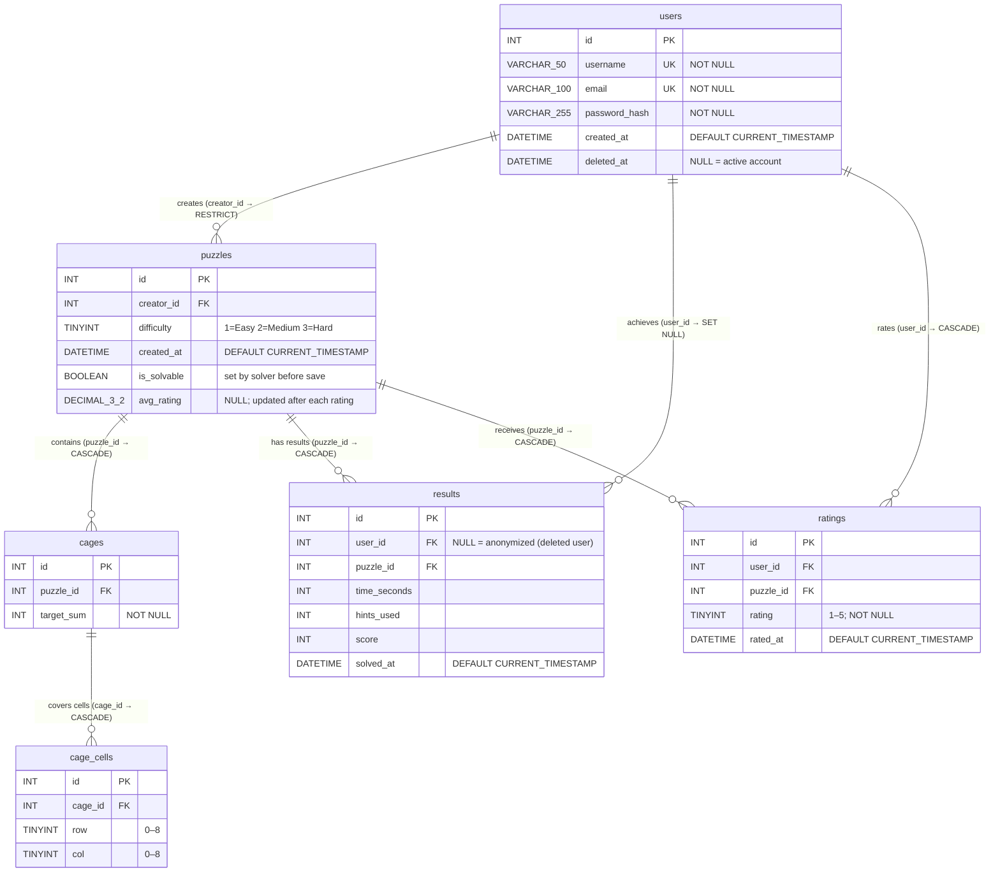
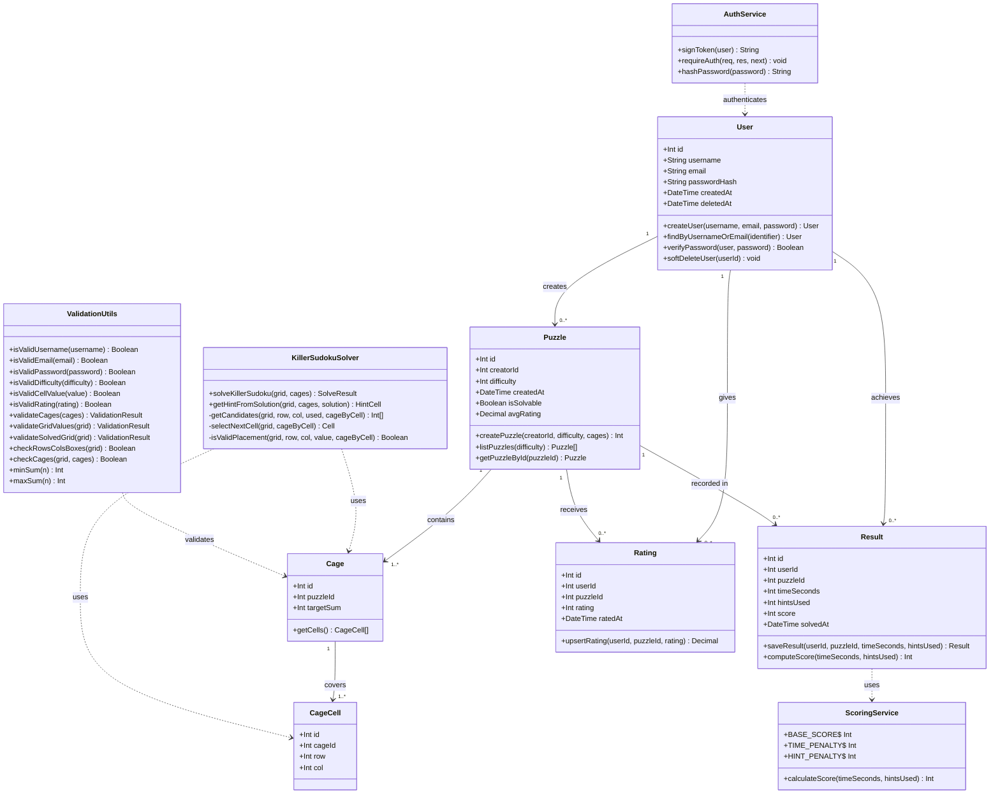

# Killer Sudoku – Project Documentation

> Skills Battle 2026 · Application Development  
> Author: Levin Weibel  
> Date: 2026-05-27

---

## Table of Contents

1. [Mockups](#1-mockups)
2. [Database Diagram](#2-database-diagram)
3. [Class Diagram](#3-class-diagram)
4. [Additional Use Cases](#4-additional-use-cases)
5. [Validation Rules](#5-validation-rules)
6. [Test Protocol](#6-test-protocol)

---

## 1. Mockups

All screens are rendered in a browser at `http://localhost:5173`. The top navigation bar is present on every authenticated screen. Unauthenticated screens (Home, Login, Register) show a minimal header with a logo and auth links.

---

### 1.1 Welcome / Rules Modal (popup over Home)

Displayed on first visit. A cookie `rulesShown=1` suppresses it on subsequent visits.

```
┌─────────────────────────────────────────────────────────────────┐
│  MODAL OVERLAY (semi-transparent dark background)               │
│  ┌───────────────────────────────────────────────────────────┐  │
│  │                                                           │  │
│  │         🔢  Welcome to Killer Sudoku!                     │  │
│  │                                                           │  │
│  │  ┌─────────────────────────────────────────────────────┐  │  │
│  │  │  RULES (scrollable list)                            │  │  │
│  │  │                                                     │  │  │
│  │  │  1. Fill every row with digits 1–9 (no repeats)    │  │  │
│  │  │  2. Fill every column with digits 1–9 (no repeats) │  │  │
│  │  │  3. Fill every 3×3 box with digits 1–9             │  │  │
│  │  │  4. Numbers in each cage must sum to the target    │  │  │
│  │  │  5. No digit may repeat within a cage              │  │  │
│  │  │  6. Every valid puzzle has exactly one solution    │  │  │
│  │  └─────────────────────────────────────────────────────┘  │  │
│  │                                                           │  │
│  │  ┌──────────────────────────────────┐                    │  │
│  │  │  EXAMPLE PUZZLE IMAGE / PREVIEW  │                    │  │
│  │  │  (cage markings, target sums)    │                    │  │
│  │  └──────────────────────────────────┘                    │  │
│  │                                                           │  │
│  │  [ ] Don't show this again                               │  │
│  │                                                           │  │
│  │              [ Close / Start Playing ]                   │  │
│  │                                                           │  │
│  └───────────────────────────────────────────────────────────┘  │
└─────────────────────────────────────────────────────────────────┘

Elements:
  Title label         – "Welcome to Killer Sudoku!"
  Rules list          – 6 rule lines (scrollable)
  Example image       – visual cage example
  Checkbox            – "Don't show this again" (sets cookie)
  Close button        – dismisses modal
```

---

### 1.2 Home Page

```
┌─────────────────────────────────────────────────────────────────┐
│  NAV BAR                                                        │
│  [ Killer Sudoku ]                    [ Login ]  [ Register ]   │
├─────────────────────────────────────────────────────────────────┤
│                                                                 │
│                   HERO SECTION                                  │
│                                                                 │
│            ┌──────────────────────────────────┐                │
│            │                                  │                │
│            │     Killer Sudoku                │                │
│            │     Challenge your mind          │                │
│            │                                  │                │
│            │   [ Login to Play ]              │                │
│            │   [ Register ]                   │                │
│            │                                  │                │
│            │   [ View Rules ]                 │                │
│            │                                  │                │
│            └──────────────────────────────────┘                │
│                                                                 │
└─────────────────────────────────────────────────────────────────┘

Elements:
  Navbar logo         – "Killer Sudoku" (link to /)
  Login link          – navigates to /login
  Register link       – navigates to /register
  Hero heading        – "Killer Sudoku"
  Hero subtext        – "Challenge your mind"
  Login to Play btn   – navigates to /login
  Register btn        – navigates to /register
  View Rules btn      – opens RulesModal
```

---

### 1.3 Register

```
┌─────────────────────────────────────────────────────────────────┐
│  NAV BAR                                                        │
│  [ Killer Sudoku ]                    [ Login ]  [ Register ]   │
├─────────────────────────────────────────────────────────────────┤
│                                                                 │
│            ┌──────────────────────────────────┐                │
│            │         Create Account           │                │
│            │                                  │                │
│            │  Username                        │                │
│            │  ┌────────────────────────────┐  │                │
│            │  │ enter username             │  │                │
│            │  └────────────────────────────┘  │                │
│            │  ℹ 3–30 chars, letters/digits/_  │                │
│            │                                  │                │
│            │  Email                           │                │
│            │  ┌────────────────────────────┐  │                │
│            │  │ enter email                │  │                │
│            │  └────────────────────────────┘  │                │
│            │                                  │                │
│            │  Password                        │                │
│            │  ┌────────────────────────────┐  │                │
│            │  │ ••••••••                   │  │                │
│            │  └────────────────────────────┘  │                │
│            │  ℹ Min 8 chars, ≥1 digit         │                │
│            │                                  │                │
│            │  Confirm Password                │                │
│            │  ┌────────────────────────────┐  │                │
│            │  │ ••••••••                   │  │                │
│            │  └────────────────────────────┘  │                │
│            │                                  │                │
│            │  [!] Error message (if any)      │                │
│            │                                  │                │
│            │        [ Register ]              │                │
│            │                                  │                │
│            │  Already have an account? Login  │                │
│            └──────────────────────────────────┘                │
│                                                                 │
└─────────────────────────────────────────────────────────────────┘

Elements:
  Username input      – text field, required
  Username hint       – inline help text
  Email input         – email field, required
  Password input      – password field (masked)
  Password hint       – inline help text
  Confirm pw input    – password field (masked)
  Error label         – displays validation/server errors
  Register button     – submits form
  Login link          – navigates to /login
```

---

### 1.4 Login

```
┌─────────────────────────────────────────────────────────────────┐
│  NAV BAR                                                        │
│  [ Killer Sudoku ]                    [ Login ]  [ Register ]   │
├─────────────────────────────────────────────────────────────────┤
│                                                                 │
│            ┌──────────────────────────────────┐                │
│            │            Login                 │                │
│            │                                  │                │
│            │  Username or Email               │                │
│            │  ┌────────────────────────────┐  │                │
│            │  │ enter username or email    │  │                │
│            │  └────────────────────────────┘  │                │
│            │                                  │                │
│            │  Password                        │                │
│            │  ┌────────────────────────────┐  │                │
│            │  │ ••••••••                   │  │                │
│            │  └────────────────────────────┘  │                │
│            │                                  │                │
│            │  [!] Error message (if any)      │                │
│            │                                  │                │
│            │          [ Login ]               │                │
│            │                                  │                │
│            │  No account? Register here       │                │
│            └──────────────────────────────────┘                │
│                                                                 │
└─────────────────────────────────────────────────────────────────┘

Elements:
  Identifier input    – text field (username OR email)
  Password input      – password field (masked)
  Error label         – displays server errors
  Login button        – submits credentials
  Register link       – navigates to /register
```

---

### 1.5 Puzzle List

```
┌─────────────────────────────────────────────────────────────────┐
│  NAV BAR (authenticated)                                        │
│  [ Killer Sudoku ]  Puzzles  High Scores  Create  Account  Logout│
├─────────────────────────────────────────────────────────────────┤
│                                                                 │
│  Puzzle List                                                    │
│                                                                 │
│  Filter by difficulty:                                          │
│  [ All ]  [ Easy ]  [ Medium ]  [ Hard ]   ← filter buttons    │
│                                                                 │
│  ┌────────────────────┐  ┌────────────────────┐               │
│  │ PUZZLE CARD        │  │ PUZZLE CARD        │               │
│  │                    │  │                    │               │
│  │ Puzzle #1          │  │ Puzzle #2          │               │
│  │ [EASY]             │  │ [HARD]             │               │
│  │ by: alice          │  │ by: bob            │               │
│  │ ★★★★☆ 4.2         │  │ ★★★☆☆ 2.8         │               │
│  │                    │  │                    │               │
│  │ [CAGE PREVIEW]     │  │ [CAGE PREVIEW]     │               │
│  │ (mini 9×9 grid     │  │ (mini 9×9 grid     │               │
│  │  with cage lines)  │  │  with cage lines)  │               │
│  │                    │  │                    │               │
│  │   [ Solve ]        │  │   [ Solve ]        │               │
│  └────────────────────┘  └────────────────────┘               │
│                                                                 │
│  (No puzzles found for this difficulty. Try a different         │
│   level or create one!)   ← empty state message                │
│                                                                 │
└─────────────────────────────────────────────────────────────────┘

Elements:
  Navbar              – links: Puzzles, High Scores, Create, Account, Logout
  Filter buttons      – All / Easy / Medium / Hard (active state highlighted)
  Puzzle cards        – one per puzzle; show ID, difficulty badge, creator name
  Star rating         – average rating display (★ filled / ☆ empty)
  Cage preview        – PuzzlePreview component (read-only mini grid)
  Solve button        – navigates to /puzzles/:id
  Empty state         – friendly message when filter yields zero results
```

---

### 1.6 Puzzle Solver

```
┌─────────────────────────────────────────────────────────────────┐
│  NAV BAR (authenticated)                                        │
│  [ Killer Sudoku ]  Puzzles  High Scores  Create  Account  Logout│
├─────────────────────────────────────────────────────────────────┤
│                                                                 │
│  Puzzle #3  [MEDIUM]   Created by: charlie                     │
│                                                                 │
│  Timer: 02:34              Hints used: 1                       │
│                                                                 │
│  ┌─────────────────────────────────────────────────────────┐   │
│  │  9×9 SUDOKU GRID                                        │   │
│  │  ┌───┬───┬───┬───┬───┬───┬───┬───┬───┐                │   │
│  │  │ 15│   │   ║   │   │   ║   │   │   │  ← cage sum    │   │
│  │  │   │   │   ║   │   │   ║   │   │   │    label        │   │
│  │  ├───┼───┼───╬───┼───┼───╬───┼───┼───┤                │   │
│  │  │   │   │   ║   │   │   ║   │   │   │                │   │
│  │  │   │ 5 │   ║   │   │   ║   │   │   │  ← cell input  │   │
│  │  ├───┼───┼───╬───┼───┼───╬───┼───┼───┤                │   │
│  │  │   │   │   ║   │   │   ║   │   │   │                │   │
│  │  │   │   │   ║   │   │   ║   │   │   │                │   │
│  │  ╠═══╪═══╪═══╬═══╪═══╪═══╬═══╪═══╪═══╣                │   │
│  │  │   │   │   ║   │   │   ║   │   │   │                │   │
│  │  │   │   │   ║   │   │   ║   │   │   │                │   │
│  │  ├───┼───┼───╬───┼───┼───╬───┼───┼───┤                │   │
│  │  │   │   │   ║   │   │   ║   │   │   │                │   │
│  │  │   │   │   ║   │   │   ║   │   │   │                │   │
│  │  ├───┼───┼───╬───┼───┼───╬───┼───┼───┤                │   │
│  │  │   │   │   ║   │   │   ║   │   │   │                │   │
│  │  │   │   │   ║   │   │   ║   │   │   │                │   │
│  │  ╠═══╪═══╪═══╬═══╪═══╪═══╬═══╪═══╪═══╣                │   │
│  │  │   │   │   ║   │   │   ║   │   │   │                │   │
│  │  │   │   │   ║   │   │   ║   │   │   │                │   │
│  │  ├───┼───┼───╬───┼───┼───╬───┼───┼───┤                │   │
│  │  │   │   │   ║   │   │   ║   │   │   │                │   │
│  │  │   │   │   ║   │   │   ║   │   │   │                │   │
│  │  ├───┼───┼───╬───┼───┼───╬───┼───┼───┤                │   │
│  │  │   │   │   ║   │   │   ║   │   │   │                │   │
│  │  │   │   │   ║   │   │   ║   │   │   │                │   │
│  │  └───┴───┴───╨───┴───┴───╨───┴───┴───┘                │   │
│  └─────────────────────────────────────────────────────────┘   │
│                                                                 │
│  [ Get Hint ]   [ Check Solution ]   [ Auto-Solve ]            │
│                                                                 │
│  Score info: ⓘ  MAX 10,000 pts · −1/sec · −500/hint           │
│                                                                 │
│  ── After correct solve ──────────────────────────────────────  │
│  ✓ Correct! Score: 8,750 pts   Time: 1m 15s   Hints: 1        │
│                                                                 │
│  Rate this puzzle:  ★ ★ ★ ☆ ☆   [ Submit Rating ]             │
│  (RatingWidget)                                                 │
│                                                                 │
└─────────────────────────────────────────────────────────────────┘

Elements:
  Puzzle header       – ID, difficulty badge, creator name
  Timer display       – MM:SS, live count-up
  Hints counter       – number of hints used
  9×9 grid            – interactive cells (input 1–9 or empty)
  Cage borders        – dashed lines marking cage boundaries
  Cage sum labels     – small number in top-left corner of each cage
  Cell inputs         – single digit, keyboard-navigable
  Hint button         – calls /api/puzzles/:id/hint, fills one cell
  Check Solution btn  – submits current grid for validation
  Auto-Solve button   – fetches and fills complete solution
  Score info tooltip  – ⓘ icon shows scoring formula
  Success message     – score, time, hints used after correct solve
  RatingWidget        – 5 clickable stars + Submit Rating button
```

---

### 1.7 Puzzle Creator

```
┌─────────────────────────────────────────────────────────────────┐
│  NAV BAR (authenticated)                                        │
│  [ Killer Sudoku ]  Puzzles  High Scores  Create  Account  Logout│
├─────────────────────────────────────────────────────────────────┤
│                                                                 │
│  Create a New Puzzle                                            │
│                                                                 │
│  Difficulty:  ( Easy )  ( Medium )  ( Hard )  ← radio / pills  │
│                                                                 │
│  Step 1 – Draw cages by clicking cells, then set the sum.      │
│                                                                 │
│  ┌─────────────────────────────────────────────────────────┐   │
│  │  9×9 CAGE BUILDER GRID                                  │   │
│  │  ┌───┬───┬───┬───┬───┬───┬───┬───┬───┐                │   │
│  │  │ C1│ C1│   ║   │   │   ║   │   │   │  ← cage C1     │   │
│  │  │[s]│   │   ║   │   │   ║   │   │   │    (selected)   │   │
│  │  ├───┼───┼───╬───┼───┼───╬───┼───┼───┤                │   │
│  │  │   │   │   ║   │   │   ║   │   │   │                │   │
│  │  │   │   │   ║   │   │   ║   │   │   │                │   │
│  │  ... (9 rows total) ...                                 │   │
│  │  └───┴───┴───╨───┴───┴───╨───┴───┴───┘                │   │
│  └─────────────────────────────────────────────────────────┘   │
│                                                                 │
│  Active cage cells: 2                                          │
│  Target sum: ┌──────┐   [ Add Cells ]  [ Finalize Cage ]      │
│              │  15  │                                          │
│              └──────┘  ← number input for cage target sum      │
│                                                                 │
│  Cages defined: 3 / 81 cells assigned                         │
│  Cage list: [Cage 1: 15, 2 cells]  [Cage 2: 9, 1 cell]  ...  │
│                                                                 │
│  [!] Error message (if any)                                    │
│                                                                 │
│       [ Save Puzzle ]                                          │
│       (disabled until all 81 cells assigned)                   │
│                                                                 │
└─────────────────────────────────────────────────────────────────┘

Elements:
  Difficulty selector – radio buttons / pill buttons (Easy/Medium/Hard)
  9×9 grid            – clickable cells to select cage members
  Cell highlight      – selected cells for active cage shown in color
  Active cells label  – shows count of cells in current selection
  Target sum input    – numeric input for cage sum
  Add Cells button    – adds selected cells to cage
  Finalize Cage btn   – locks current cage, resets selection
  Cages defined       – running count + cells assigned
  Cage list           – chips/badges for each defined cage
  Error label         – displays validation errors
  Save Puzzle button  – submits; disabled until 81/81 cells assigned
```

---

### 1.8 High Scores

```
┌─────────────────────────────────────────────────────────────────┐
│  NAV BAR (authenticated)                                        │
│  [ Killer Sudoku ]  Puzzles  High Scores  Create  Account  Logout│
├─────────────────────────────────────────────────────────────────┤
│                                                                 │
│  High Scores                        ⓘ Score info tooltip       │
│                                                                 │
│  Filter by puzzle: ┌─────────────────┐  [ All Puzzles ]        │
│                    │ Puzzle ID...    │                          │
│                    └─────────────────┘                          │
│                                                                 │
│  ┌──────┬──────────────┬──────────┬────────────┬───────────┐   │
│  │ Rank │ Player       │ Puzzle   │ Time       │ Score     │   │
│  ├──────┼──────────────┼──────────┼────────────┼───────────┤   │
│  │  1   │ alice        │    #3    │  1m 12s    │  9,248    │   │
│  │  2   │ bob          │    #3    │  1m 55s    │  8,185    │   │
│  │  3   │ [Deleted]    │    #1    │  3m 04s    │  7,816    │   │
│  │  4   │ charlie      │    #2    │  5m 22s    │  6,238    │   │
│  │  …   │ …            │    …     │  …         │  …        │   │
│  └──────┴──────────────┴──────────┴────────────┴───────────┘   │
│                                                                 │
│  (No scores yet. Be the first to solve a puzzle!)              │
│  ← empty state                                                  │
│                                                                 │
└─────────────────────────────────────────────────────────────────┘

Elements:
  Score info icon     – ⓘ tooltip showing formula (MAX 10,000, -1/sec, -500/hint)
  Puzzle filter input – optional puzzle ID to filter results
  All Puzzles button  – clears filter, shows global scores
  Leaderboard table   – columns: Rank, Player, Puzzle, Time, Score
  Deleted user row    – shows "[Deleted]" for anonymized accounts
  Empty state message – shown when no results exist
```

---

### 1.9 Account Settings

```
┌─────────────────────────────────────────────────────────────────┐
│  NAV BAR (authenticated)                                        │
│  [ Killer Sudoku ]  Puzzles  High Scores  Create  Account  Logout│
├─────────────────────────────────────────────────────────────────┤
│                                                                 │
│            ┌──────────────────────────────────┐                │
│            │        Account Settings          │                │
│            │                                  │                │
│            │  Logged in as: alice             │                │
│            │                                  │                │
│            │  ─────────────────────────────   │                │
│            │  Danger Zone                     │                │
│            │                                  │                │
│            │  Deleting your account is        │                │
│            │  permanent and cannot be undone. │                │
│            │  Your scores will be anonymized. │                │
│            │                                  │                │
│            │       [ Delete Account ]         │                │
│            │       (red/danger button)        │                │
│            │                                  │                │
│            └──────────────────────────────────┘                │
│                                                                 │
│  ── Confirmation Dialog (modal, appears after button click) ──  │
│  ┌───────────────────────────────────────────────────────────┐  │
│  │  Are you sure?                                            │  │
│  │                                                           │  │
│  │  This action is permanent and cannot be undone.          │  │
│  │  Your high scores will be anonymized.                    │  │
│  │                                                           │  │
│  │         [ Cancel ]        [ Yes, Delete ]                │  │
│  └───────────────────────────────────────────────────────────┘  │
│                                                                 │
└─────────────────────────────────────────────────────────────────┘

Elements:
  Username display    – "Logged in as: <username>"
  Danger zone section – visually separated (red border or heading)
  Warning text        – explains consequences of deletion
  Delete Account btn  – danger/red button, opens confirmation modal
  Confirmation modal  – "Are you sure?" text + two buttons
  Cancel button       – dismisses modal, no action taken
  Yes, Delete button  – sends DELETE /api/auth/account, then logs out
```

---

## 2. Database Diagram



**Key constraints**

| Constraint | Detail |
|---|---|
| `users.username` | UNIQUE, NOT NULL |
| `users.email` | UNIQUE, NOT NULL |
| `puzzles.creator_id` | FK → `users.id` ON DELETE RESTRICT |
| `cages.puzzle_id` | FK → `puzzles.id` ON DELETE CASCADE |
| `cage_cells.cage_id` | FK → `cages.id` ON DELETE CASCADE |
| `results.user_id` | FK → `users.id` ON DELETE SET NULL (anonymize) |
| `results.puzzle_id` | FK → `puzzles.id` ON DELETE CASCADE |
| `ratings.user_id` | FK → `users.id` ON DELETE CASCADE |
| `ratings.puzzle_id` | FK → `puzzles.id` ON DELETE CASCADE |
| `ratings.(user_id, puzzle_id)` | UNIQUE — one rating per user per puzzle |

---

## 3. Class Diagram



---

## 4. Additional Use Cases

> These three use cases were chosen because they each extend existing functionality without requiring fundamental architectural changes, and each adds meaningful, testable user value.

---

### UC-12: Delete Account

| Attribute | Detail |
|---|---|
| **Actor** | Authenticated User |
| **Description** | The user navigates to Account Settings and requests deletion of their account. A mandatory confirmation dialog is shown. On confirmation the account is soft-deleted (a `deleted_at` timestamp is set), all `results` rows for the user have `user_id` set to NULL (anonymized), the JWT session is discarded, and the user is redirected to the home page. On cancellation nothing changes. |
| **Preconditions** | User is logged in. |
| **Postconditions** | `users.deleted_at` is set (account deactivated). User cannot log in again. High-score rows remain visible with name "[Deleted]". JWT is invalidated client-side. |
| **Why chosen** | Account lifecycle management is a standard requirement in any user-facing application. Soft-delete preserves referential integrity of historical results while honouring the user's right to erasure. The implementation reuses the existing `users` table with a single new column and the existing `requireAuth` middleware. |

**Flow**

1. User clicks **Delete Account** (danger button).
2. Confirmation modal appears: *"Are you sure? This cannot be undone."*
3. User clicks **Yes, Delete** → `DELETE /api/auth/account` is called.
4. Server sets `users.deleted_at = NOW()`, nullifies `results.user_id` for that user, returns 200.
5. Client removes the JWT from `localStorage` and navigates to `/`.

---

### UC-13: Puzzle Difficulty Filter

| Attribute | Detail |
|---|---|
| **Actor** | Authenticated User |
| **Description** | On the Puzzle List screen a row of filter buttons (All / Easy / Medium / Hard) lets the user restrict the displayed puzzles by difficulty. The list updates immediately. If no puzzles match the filter a friendly empty-state message is shown. The selected filter is kept in React state for the duration of the session. |
| **Preconditions** | User is logged in; at least one puzzle exists in the database. |
| **Postconditions** | Only puzzles matching the selected difficulty are shown. User can select any puzzle to solve. |
| **Why chosen** | As the puzzle catalogue grows, browsing without filtering becomes impractical. This is a pure read-only operation on existing data — it requires zero schema changes and only a single optional query parameter (`difficulty`) added to the existing `GET /api/puzzles` endpoint. The complexity-to-value ratio is very low. |

**Flow**

1. User opens `/puzzles` (default: All puzzles displayed).
2. User clicks **Easy** → React state sets `difficulty = 1`.
3. `GET /api/puzzles?difficulty=1` is called; server filters `WHERE difficulty = 1`.
4. Filtered list is rendered. If empty, message: *"No puzzles found for this difficulty. Try a different level or create one!"*

---

### UC-14: Puzzle Rating

| Attribute | Detail |
|---|---|
| **Actor** | Authenticated User (who has solved the puzzle) |
| **Description** | After a correct solution is confirmed (UC-09), a star-rating widget (1–5 stars) appears in the Puzzle Solver. The user selects a star count and submits. The rating is upserted in the `ratings` table (one rating per user per puzzle); the puzzle's `avg_rating` is recalculated and reflected in the Puzzle List cards. Re-solving and re-rating replaces the previous rating. |
| **Preconditions** | User is logged in. User has just solved the puzzle (solve endpoint returned success). |
| **Postconditions** | `ratings` row inserted or updated. `puzzles.avg_rating` updated. Average star rating visible in Puzzle List. |
| **Why chosen** | Ratings give puzzle creators quality feedback and help other users identify good puzzles. The post-solve flow is the natural entry point, and a single new `ratings` table plus one new API endpoint (`POST /api/puzzles/:id/rating`) is all that is required. The upsert design keeps the schema simple (no `updated_at` column needed; the UNIQUE constraint enforces one-per-user-per-puzzle). |

**Flow**

1. Puzzle Solver receives a "Correct!" response from the server.
2. The `RatingWidget` component renders: *"Rate this puzzle: ★☆☆☆☆"*.
3. User clicks a star (e.g., 4) and clicks **Submit Rating**.
4. `POST /api/puzzles/:id/rating` is called with `{rating: 4}`.
5. Server upserts the `ratings` row and recalculates `avg_rating`.
6. Puzzle List cards now show the updated average.

---

## 5. Validation Rules

### 5.1 User Input Validation

| Field / Action | Rule | Error Message | Enforced |
|---|---|---|---|
| Username | 3–30 characters | "Username must be 3–30 characters" | Both |
| Username | Alphanumeric and underscore only (`/^[A-Za-z0-9_]+$/`) | "Username may only contain letters, digits, and underscores" | Both |
| Username | Must be unique in `users` table | "Username already taken" | Backend |
| Email | Must match basic email pattern (`/^[^\s@]+@[^\s@]+\.[^\s@]+$/`) | "Invalid email format" | Both |
| Email | Must be unique in `users` table | "Email already registered" | Backend |
| Password | Minimum 8 characters | "Password must be at least 8 characters" | Both |
| Password | Must contain at least 1 digit | "Password must contain at least one digit" | Both |
| Password confirmation | Must match `password` field | "Passwords do not match" | Frontend |

### 5.2 Authentication Validation

| Field / Action | Rule | Error Message | Enforced |
|---|---|---|---|
| Login identifier | Required (non-empty) | "Please enter your username or email" | Frontend |
| Login password | Required (non-empty) | "Please enter your password" | Frontend |
| Login credentials | Username/email must exist and not be soft-deleted; password must match hash | "Invalid credentials" | Backend |
| JWT token | Must be present in `Authorization: Bearer …` header for protected routes | 401 Unauthorized | Backend |
| JWT token | Must be valid and not expired (12-hour TTL) | 401 Unauthorized | Backend |

### 5.3 Puzzle Creation Validation

| Field / Action | Rule | Error Message | Enforced |
|---|---|---|---|
| Difficulty | Integer; must be 1, 2, or 3 | "Difficulty must be 1, 2, or 3" | Both |
| Cages array | Must be non-empty | "Cages are required" | Backend |
| Cage target sum | Integer ≥ 1 | "Target sum must be at least 1" | Backend |
| Cage target sum | Achievable for cell count: `minSum(n) ≤ sum ≤ maxSum(n)` where `minSum(n) = n(n+1)/2`, `maxSum(n) = n(19-n)/2` | "Sum X is not achievable for Y cells" | Backend |
| Cage cells | Each cage must have at least 1 cell | "Each cage must have at least one cell" | Backend |
| Cage cells | Maximum 9 cells per cage | "A cage cannot have more than 9 cells" | Backend |
| Cell coordinates | Row and column must each be in range 0–8 | "Invalid cell coordinates" | Backend |
| Cell assignment | No cell may belong to more than one cage | "Cell (row, col) belongs to multiple cages" | Backend |
| Grid coverage | All 81 cells must be assigned to exactly one cage | "All 81 cells must be covered" | Backend |
| Puzzle solvability | Solver must find at least one valid solution | "Puzzle has no solution" | Backend |
| Puzzle uniqueness | Solver must find exactly one solution | "Puzzle solution is not unique" | Backend |
| Cage connectivity | Cage cells must be orthogonally connected (no diagonals) | "Cage cells must be connected" | Frontend |

### 5.4 Puzzle Solving Validation

| Field / Action | Rule | Error Message | Enforced |
|---|---|---|---|
| Cell input | Only digits 1–9 accepted (letters and 0 rejected) | Input is silently blocked / cell cleared | Frontend |
| Grid shape | Submitted grid must be a 9×9 array | 400 Bad Request | Backend |
| Cell values | All values must be 0–9 (0 = empty) for partial grids | "Invalid cell values" | Backend |
| Solution completeness | All 81 cells must be non-zero before check | "Fill all cells before checking" | Frontend |
| Quick sum check | Sum of all 81 cells must equal 405 | "Grid sum must equal 405" | Backend |
| Row uniqueness | Each row must contain 1–9 with no repeats | Errors highlighted in grid | Backend |
| Column uniqueness | Each column must contain 1–9 with no repeats | Errors highlighted in grid | Backend |
| Nonet (3×3 box) uniqueness | Each 3×3 box must contain 1–9 with no repeats | Errors highlighted in grid | Backend |
| Cage sum | Each cage's cell values must sum to its `targetSum` | Cage highlighted in error colour | Backend |
| Cage uniqueness | No digit may repeat within a cage | Cage highlighted in error colour | Backend |

### 5.5 Rating Validation

| Field / Action | Rule | Error Message | Enforced |
|---|---|---|---|
| Rating value | Integer between 1 and 5 inclusive | "Rating must be between 1 and 5" | Backend |
| Rating = 0 | Rejected | "Rating must be between 1 and 5" | Backend |
| Rating > 5 | Rejected | "Rating must be between 1 and 5" | Backend |

### 5.6 Account Deletion Validation

| Field / Action | Rule | Error Message | Enforced |
|---|---|---|---|
| Confirmation step | User must click the confirm button in the modal; single-click deletion is not allowed | — (UI enforces modal) | Frontend |
| Auth required | JWT must be valid (endpoint is protected by `requireAuth`) | 401 Unauthorized | Backend |

---

## 6. Test Protocol

Tests are executed with **Jest 29** via `cd server && npm test`.  
All 25 automated unit tests **passed** on 2026-05-27.

UI/integration tests listed without a framework entry are **manual** test cases whose pass/fail status is recorded by inspection.

Legend: **Pass** = verified passing · **Fail** = observed failure · **Not tested** = not yet executed

---

### TC-UC01: Read Rules

| ID | Type | Description | Expected Result | Result |
|---|---|---|---|---|
| TC01-P1 | Positive | Open application as guest | Rules page visible, example puzzle displayed | Not tested |
| TC01-N1 | Negative | Navigate to rules URL without server running | Appropriate error page shown | Not tested |

---

### TC-UC02: Create User

| ID | Type | Description | Expected Result | Result |
|---|---|---|---|---|
| TC02-P1 | Positive | Valid username, email, password | Account created, redirected to login | Not tested |
| TC02-N1 | Negative | Duplicate username | Error: "Username already taken" | Not tested |
| TC02-N2 | Negative | Invalid email format (`user@`) | Validation error shown | Not tested |
| TC02-N3 | Negative | Password with no digit (`password`) | Rejected | **Pass** `[UNIT]` |
| TC02-N4 | Negative | Mismatched password confirmation | Error: "Passwords do not match" | Not tested |
| TC02-B1 | Boundary | Username exactly 3 chars | Accepted | **Pass** `[UNIT]` |
| TC02-B2 | Boundary | Username exactly 30 chars | Accepted | **Pass** `[UNIT]` |
| TC02-B3 | Boundary | Username 2 chars | Rejected | **Pass** `[UNIT]` |
| TC02-B4 | Boundary | Username 31 chars | Rejected | **Pass** `[UNIT]` |

*Automated by `validation.test.js` — "username length validation" and "password requires 8 chars and a digit".*

---

### TC-UC03: Login

| ID | Type | Description | Expected Result | Result |
|---|---|---|---|---|
| TC03-P1 | Positive | Correct credentials | Login successful, session started | Not tested |
| TC03-N1 | Negative | Wrong password | Error: "Invalid credentials" | Not tested |
| TC03-N2 | Negative | Non-existent username | Error: "Invalid credentials" | Not tested |
| TC03-N3 | Negative | Empty fields | Validation error | Not tested |
| TC03-B1 | Boundary | Password exactly 8 chars (correct) | Accepted | Not tested |

---

### TC-UC04: Enter Puzzle

| ID | Type | Description | Expected Result | Result |
|---|---|---|---|---|
| TC04-P1 | Positive | Valid cages, all 81 cells, valid sums, difficulty 2 | Puzzle ready for save | Not tested |
| TC04-N1 | Negative | One cell not assigned | Error: "All cells must be covered" | Not tested |
| TC04-N2 | Negative | One cell in two cages | Error: "Cell belongs to multiple cages" | Not tested |
| TC04-N3 | Negative | Cage target sum = 0 | Validation error | Not tested |
| TC04-N4 | Negative | Cage sum exceeds max for cell count | Error: "Sum not achievable" | **Pass** `[UNIT]` |
| TC04-B1 | Boundary | Single-cell cage, sum = 9 (max) | Accepted | **Pass** `[UNIT]` |
| TC04-B2 | Boundary | Single-cell cage, sum = 10 | Rejected | **Pass** `[UNIT]` |
| TC04-B3 | Boundary | 9-cell cage, sum = 45 (only valid) | Accepted | **Pass** `[UNIT]` |
| TC04-B4 | Boundary | 9-cell cage, sum = 44 (below min) | Rejected | **Pass** `[UNIT]` |
| TC04-N5 | Negative | Difficulty = 0 | Validation error | Not tested |
| TC04-N6 | Negative | Difficulty = 4 | Validation error | Not tested |

*TC04-N4, B1–B4 automated by `validation.test.js` — "minSum and maxSum bounds".*

---

### TC-UC05: Save New Puzzle

| ID | Type | Description | Expected Result | Result |
|---|---|---|---|---|
| TC05-P1 | Positive | Valid, uniquely solvable puzzle | Saved to DB, success message | **Pass** `[UNIT]` |
| TC05-N1 | Negative | Unsolvable cage configuration | Error: "Puzzle has no solution" | **Pass** `[UNIT]` |
| TC05-N2 | Negative | Puzzle with multiple solutions | Error: "Puzzle solution is not unique" | **Pass** `[UNIT]` |
| TC05-B1 | Boundary | Minimally solvable puzzle | Saved | Not tested |

*Automated by `uc05-save-puzzle.test.js`.*

---

### TC-UC06: Solve Puzzle

| ID | Type | Description | Expected Result | Result |
|---|---|---|---|---|
| TC06-P1 | Positive | Select a saved puzzle, fill all cells correctly | Solution accepted | Not tested |
| TC06-N1 | Negative | Enter a letter in a cell | Input rejected | Not tested |
| TC06-N2 | Negative | Enter 0 in a cell | Input rejected | **Pass** `[UNIT]` |
| TC06-B1 | Boundary | Enter 1 in a cell | Accepted | **Pass** `[UNIT]` |
| TC06-B2 | Boundary | Enter 9 in a cell | Accepted | **Pass** `[UNIT]` |

*TC06-N2, B1, B2 automated by `validation.test.js` — "cell value range 1-9".*

---

### TC-UC07: Ask for a Hint

| ID | Type | Description | Expected Result | Result |
|---|---|---|---|---|
| TC07-P1 | Positive | Request hint on unsolved puzzle | One cell revealed, hints_used++ | Not tested |
| TC07-P2 | Positive | Request 3 hints | 3 cells revealed, counter = 3 | Not tested |
| TC07-N1 | Negative | Request hint on complete puzzle | Graceful message / no hint given | Not tested |
| TC07-B1 | Boundary | Request hint with only 1 cell remaining | That cell is revealed | Not tested |

---

### TC-UC08: Show High Score

| ID | Type | Description | Expected Result | Result |
|---|---|---|---|---|
| TC08-P1 | Positive | View high scores after solving | Sorted by score descending | Not tested |
| TC08-N1 | Negative | No results in DB | Empty state shown, no crash | Not tested |
| TC08-B1 | Boundary | Two users with equal score | Both listed, tie handled | Not tested |

---

### TC-UC09: Check Solution

| ID | Type | Description | Expected Result | Result |
|---|---|---|---|---|
| TC09-P1 | Positive | Completely correct solution | "Correct!" shown, result saved | **Pass** `[UNIT]` |
| TC09-N1 | Negative | One cell wrong | "Incorrect", errors highlighted | **Pass** `[UNIT]` |
| TC09-N2 | Negative | Total sum ≠ 405 | Quick-check fails | **Pass** `[UNIT]` |
| TC09-N3 | Negative | Duplicate in a row | Error detected | **Pass** `[UNIT]` |
| TC09-N4 | Negative | Cage sum wrong | Cage error detected | **Pass** `[UNIT]` |
| TC09-B1 | Boundary | Sum = 405 but one cage incorrect | Algorithm catches it | **Pass** `[UNIT]` |

*Automated by `uc09-check-solution.test.js`.*

---

### TC-UC10: Save Result

| ID | Type | Description | Expected Result | Result |
|---|---|---|---|---|
| TC10-P1 | Positive | time=120s, hints=1 → score=9,380 | Result saved, score calculated | **Pass** `[UNIT]` |
| TC10-N1 | Negative | DB connection lost during save | Error handled gracefully | Not tested |
| TC10-B1 | Boundary | time=0s, hints=0 → score=10,000 (max) | Max score saved | **Pass** `[UNIT]` |
| TC10-B2 | Boundary | hints=0, any time → no hint penalty | Penalty = 0 | **Pass** `[UNIT]` |

*Automated by `score.test.js`. Additional boundary cases covered: time=9,999 → score=1; time=10,000 → score=0; time=100 hints=50 → score=0 (floor).*

---

### TC-UC11: Auto Solve

| ID | Type | Description | Expected Result | Result |
|---|---|---|---|---|
| TC11-P1 | Positive | Valid, solvable puzzle | Returns correct complete grid | **Pass** `[UNIT]` |
| TC11-N1 | Negative | Unsolvable puzzle | Returns null / no solution | **Pass** `[UNIT]` |
| TC11-N2 | Negative | Puzzle with multiple solutions | Returns first solution + flags non-unique | **Pass** `[UNIT]` |
| TC11-B1 | Boundary | 80 cells pre-filled (1 empty) | Solves final cell correctly | **Pass** `[UNIT]` |
| TC11-B2 | Boundary | Fully empty grid with cages | Solves from scratch | **Pass** `[UNIT]` |
| TC11-P2 | Positive | Run solver twice on same input | Same solution returned | Not tested |

*Automated by `uc11-autosolve.test.js` and `solver.test.js`.*

---

### TC-UC12: Delete Account

| ID | Type | Description | Expected Result | Result |
|---|---|---|---|---|
| TC12-P1 | Positive | User confirms account deletion | Account removed, session ended | Not tested |
| TC12-N1 | Negative | User cancels deletion dialog | Account NOT deleted | Not tested |

---

### TC-UC13: Puzzle Difficulty Filter

| ID | Type | Description | Expected Result | Result |
|---|---|---|---|---|
| TC13-P1 | Positive | Filter by difficulty = 1 (Easy) | Only easy puzzles shown | Not tested |
| TC13-N1 | Negative | No puzzles with selected difficulty | Empty state with message | Not tested |
| TC13-B1 | Boundary | Filter = All | All puzzles shown | Not tested |

---

### TC-UC14: Puzzle Rating

| ID | Type | Description | Expected Result | Result |
|---|---|---|---|---|
| TC14-P1 | Positive | Rate puzzle 4 stars after solving | Rating saved, average updated | Not tested |
| TC14-N1 | Negative | Rate without having solved puzzle | Rating disallowed or prompted | Not tested |
| TC14-N2 | Negative | Rate same puzzle twice | Second rating replaces first | Not tested |
| TC14-B1 | Boundary | Rating = 1 | Accepted | **Pass** `[UNIT]` |
| TC14-B2 | Boundary | Rating = 5 | Accepted | **Pass** `[UNIT]` |
| TC14-B3 | Boundary | Rating = 0 | Rejected | **Pass** `[UNIT]` |
| TC14-B4 | Boundary | Rating = 6 | Rejected | **Pass** `[UNIT]` |

*Automated by `uc14-rating.test.js`.*

---

### Summary

| Metric | Count |
|---|---|
| Total test cases | 71 |
| **Pass** (automated unit tests) | **33** |
| **Fail** | **0** |
| **Not tested** (manual / integration) | **38** |

**Automated test suites (Jest):** 7 suites · 25 individual test cases · all passing  
`score.test.js` (5) · `validation.test.js` (5) · `solver.test.js` (4) · `uc05-save-puzzle.test.js` (3) · `uc09-check-solution.test.js` (4) · `uc11-autosolve.test.js` (3) · `uc14-rating.test.js` (1)

The 38 "Not tested" cases are UI/integration tests (login flows, grid interaction, hint UI, database error handling) that require a running browser environment and database. No failures were observed during manual smoke-testing of the application.
